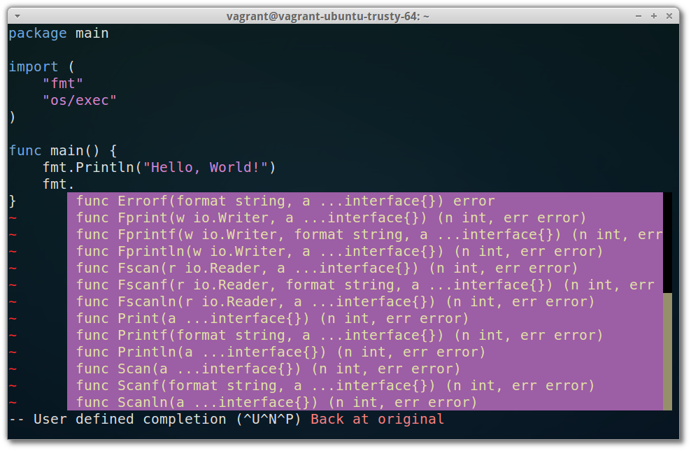

# Golang-Vagrant-Ansible (Docker or Virtualbox)

A Vagrant box (Virtualbox or Docker as providers) with Ansible provisioning
for setting up a Vim-based Golang development environment.



## Ingredients

- [Ubuntu 14.04 "trusty" LTS 64bit base image](http://www.ubuntu.com/)
- [Go(lang) 1.4.2](http://golan.org/)
- [Vim](https://github.com/Valloric/YouCompleteMe)
- [Fatih's vim-go plugin](https://github.com/fatih/vim-go), providing syntax highlight, gocode integration for autocompletion, and more.
    - See the [vim-go](https://github.com/fatih/vim-go) README for more info on how you can easily enable additional included features.
- [GoCode Go completion engine](https://github.com/nsf/gocode)
- [Valloric's YouCompleteMe](https://github.com/Valloric/YouCompleteMe) for as-you-type completion.
- [Git](http://git-scm.com/)
- [Tig - text mode interface to git](http://jonas.nitro.dk/tig/)
- [gdb - the GNU debugger](http://www.gnu.org/software/gdb)
- [cgdb - Curses based user interface to gdb](https://cgdb.github.io)

## Prerequisites

- [Vagrant](https://www.vagrantup.com/)
- [Ansible](http://www.ansible.com/)
- [VirtualBox](https://www.virtualbox.org/) (Not required if you use Docker as provider!)
- [Docker](https://www.docker.com) (Not required if you use Virtualbox as provider!)

### Installing the requirements in Ubuntu (tested with 14.04)

1. Install Virtualbox:
	```bash
	sudo apt-get install virtualbox
	```

2. Install Docker
	```bash
	sudo apt-get install docker
	```

3. Install a recent version of ansible:
   ```bash
   sudo apt-get install ansible/trusty-backports
   ```

   *(if you ubuntu version is "trusty", otherwise, replace it with your appropriate version)*
4. Install Vagrant, by first downloadng the proper .deb file from [vagrantup.com](https://www.vagrantup.com/downloads.html)

5. ... and then installing it with:
	```bash
	sudo dpkg -i <deb-file>
	```

## Setup and Usage

#### Clone the github repository:

```bash
git clone git@github.com:samuell/golang-vagrant-ansible
cd golang-vagrant-ansible
```

#### Bring up the VM

With docker provider:

```bash
vagrant up docker
```

With VirtualBox provider:

```bash
vagrant up virtualbox
```

#### Log in to the VM

With docker provider:

```bash
vagrant ssh docker
```

With VirtualBox provider:

```bash
vagrant ssh virtualbox
```

#### Create a repository for uploading to github:

```bash
mkcd ~/code/go/src/github/<user>/<repo>
git init .
```

#### Now, start coding!

```bash
vim main.go
```

#### A tip on how you can upload your existing git ssh keys to the new vm:

With the following command you can get the info you need to run scp
against the machine:

```bash
vagrant ssh-config [docker | virtualbox]
```

Note the hostname and port number (and identity file, if you with),
and run, for example:

```bash
scp -i <identity-file-path> -P <portno> \
	~/.ssh/id_rsa_<whateveryounamedit> \
	vagrant@<hostname>:/home/vagrant/.ssh/
```

Then, sometimes, in order to get the new key activated in your shell
after logging in to the vm, you might need to do:

```bash
ssh-agent bash -l
ssh-add ~/.ssh/id_rsa_<whateveryounamedit>
```

- Autocompletion will happen automatically
- If you have turned off the YouCompleteMe role, you will get autocompletion with `<C-x><C-o>`

## Known issues

- `vagrant provision docker` does not seem to work. The initial provision upon `vagrant up` works though.
- There are some red message on vagrant up, but they are nothing serious, and can be ignored for now.

## References

- [Vagrant & Ansible Quickstart Tutorial](http://adamcod.es/2014/09/23/vagrant-ansible-quickstart-tutorial.html)
